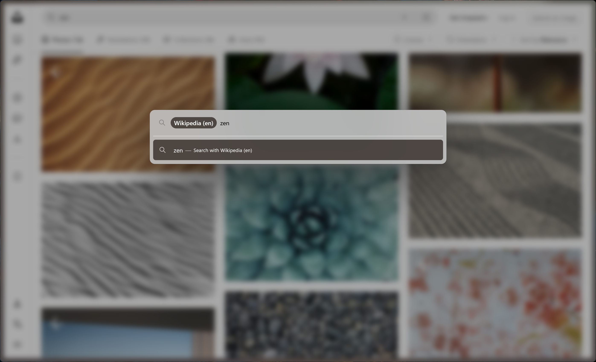
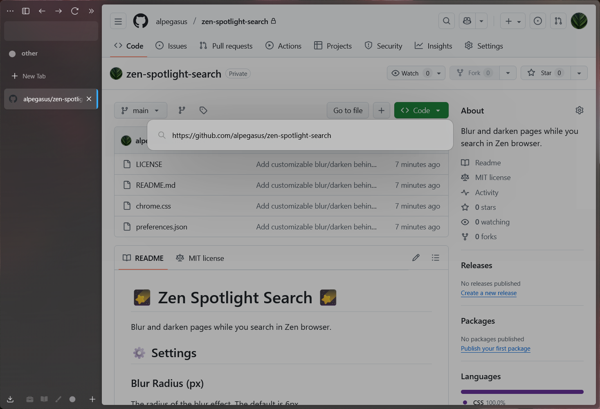
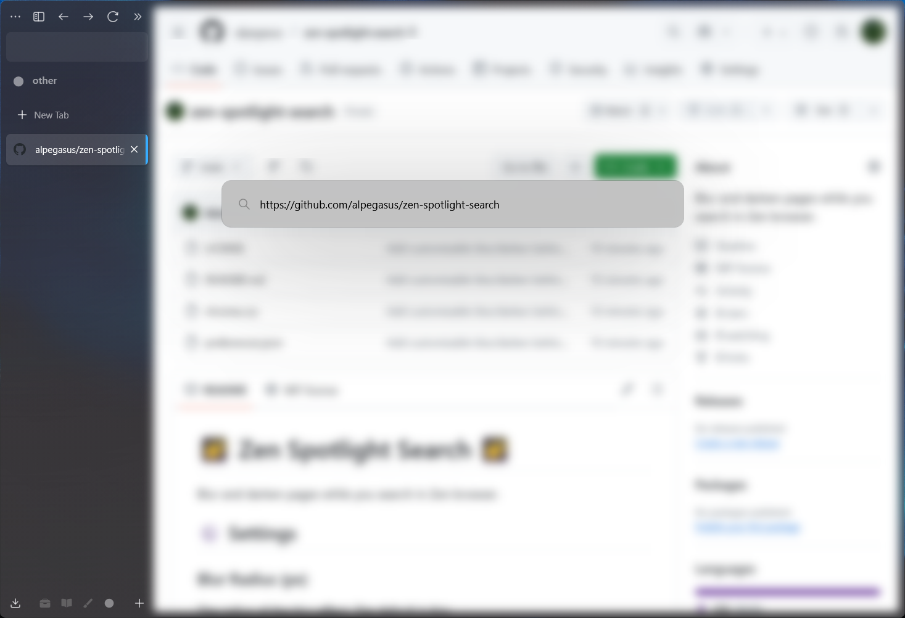
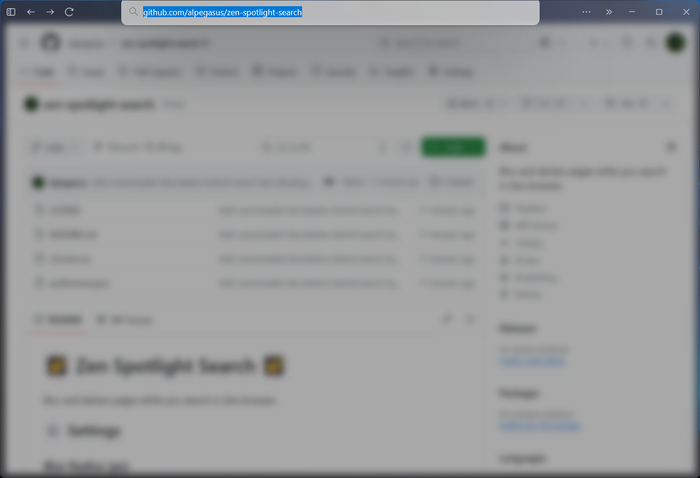
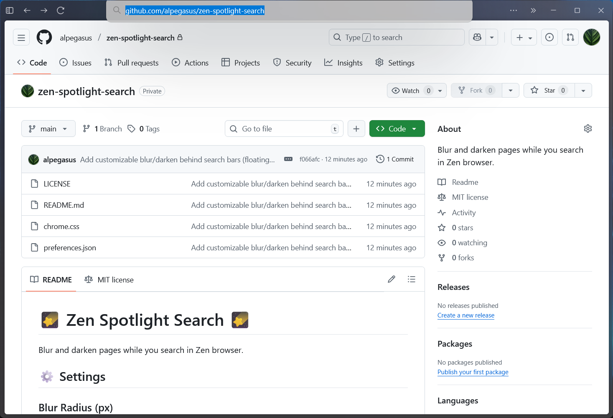

# 
<b>zen spotlight search</b>

Blur and/or darken pages behind your search bar for a more focused experience in Zen browser.

## ⚙️ Settings

### Blur Radius (px)

The radius of the blur effect. The default is `6px`.

<b>With blur turned off:</b>

### Brightness (0.0-1.0)

Darken everything behind the floating searchbar with values closer to `0`. The default is `0.66`.

<b>With dimming turned off:</b>

### Transition Duration (seconds)

How long it takes for the spotlight to transition. The default is `0.2s`.

**Note:** if [`prefers-reduced-motion`](https://developer.mozilla.org/en-US/docs/Web/CSS/Reference/At-rules/@media/prefers-reduced-motion) is on, the transition will always be `0s`.

### Apply On Floating Bar

Checkbox to enable/disable spotlight on floating search bar.

### Apply On Address Bar

Checkbox to enable/disable spotlight on address bar.

<table>
  <tr>
    <th style="text-align: center">Docked spotlight enabled:</th>
    <th style="text-align: center">Docked spotlight disabled:</th>
  </tr>
  <tr>
    <td></td>
    <td></td>
  </tr>
</table>

## 📸 Screenshots
For more, click [here](screenshots).

## 📜 License

This project is licensed under the [MIT License](LICENSE) - see the [LICENSE](LICENSE) file for details.

Please include credit to [alpegasus](https://github.com/alpegasus) (or [Zen Spotlight Search by alpegasus](https://github.com/alpegasus/zen-spotlight-search)) in any public distribution or listing of this mod.